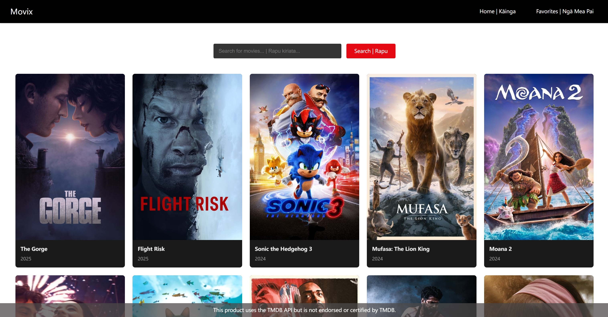

# Movix
Movix is a movie search and favorites application built with React and Vite. Users can search for movies, view movie details, and add movies to their favorites list.
## Main Features
**Movie Search:**  Users can search for movies by entering keywords.  
**Popular Movies:** The app displays popular movies on startup.  
**Movie Details:** Clicking on a movie poster shows detailed information about the movie.  
**Favorite Movies:** Users can add movies to their favorites list and view them on the favorites page.  

## Tech Stack
**React:** For building the user interface.  
**Vite:** For fast build and development.  
**React Router:** For handling routing.  
**TMDB API:** For fetching movie data.  

## Directory Explanation
**components:** Contains reusable components.  
**contexts:** Contains React Context for managing global state.  
**css:** Contains the application's CSS files.  
**pages:** Contains the application's page components.  
**services:** Contains services for API interactions.  

## Key Features
### Home Page
**Movie Search：** 
Users can enter keywords (e.g., movie titles) in the search bar to find movies. The search results are displayed in a grid or list format. 
**Popular Movies Display：** 
The Home Page showcases some popular movies by default, allowing users to browse them without needing to search. 
**Add to Favorites：** 
On the movie details page, users can click the "Favorite" button to add the movie to their favorites list. 

**View Movie Details：** 
Users can click on any movie card to view detailed information about the movie, including the title, overview, release date, poster, and more. 

### Favorites Page
**View Favorites List：** 
Users can view all their favorited movies on this page, displayed in a grid or list format. 
**Remove from Favorites：** 
Users can remove movies they are no longer interested in from their favorites list. 
**Export Favorites List：** 
Users can export their favorites list as a text file (e.g., .txt) for easy saving or sharing. 

